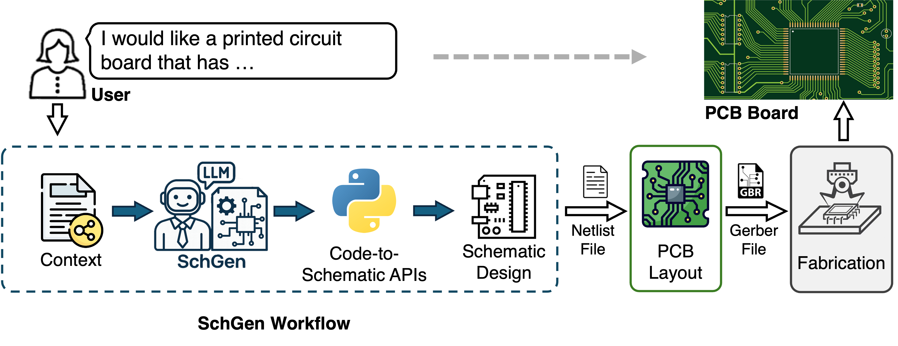

# SchGen: PCB Schematic Generation with Semantic-Grounded Code Representations

SchGen is a domain-specialized large language model and dataset framework for automated PCB schematic generation from natural-language descriptions. It introduces a scalable schematic code representation and a PCB schematic dataset collected from real-world open-source hardware designs, enabling supervised training and evaluation of LLMs for schematic synthesis.

## Key Features

- Natural-language-to-PCB schematic generation
- Semantic-grounded code representation
- Editable KiCad schematic generation
- Agentic sketch pipeline for dataset construction
- LoRA fine-tuning pipeline for GPT-oss models



The dataset is available at: [microsoft/SchGen_dataset](https://huggingface.co/datasets/microsoft/SchGen_dataset).

The model is available at: [microsoft/SchGen](https://huggingface.co/microsoft/SchGen).

To cite this project and corresponding paper, please use the following bib item:

```
@misc{luo2026schgenpcbschematicgeneration,
      title={SchGen: PCB Schematic Generation with Semantic-Grounded Code Representations}, 
      author={Qinpei Luo and Ruichun Ma and Xinyu Zhang and Lili Qiu},
      year={2026},
      eprint={2605.30345},
      archivePrefix={arXiv},
      primaryClass={cs.AI},
      url={https://arxiv.org/abs/2605.30345}, 
}
```

## Get Started

### Prerequisites

1. **LLM Model Access**

    **OpenRouter**: In the ``./config.py``, replace the variable of ``openrouter_api_key`` with your own API key.

2. **Python Environment**
    <details>
    <summary> Instructions </summary>
    
    (1) Set up a python virtual environment (Python 3.10 and Conda suggested) for the project. You can refer to the [Tutorial](https://code.visualstudio.com/docs/python/environments).

    (2) Enter your virtual environment and install python packages with:
    
    `pip install torch torchvision torchaudio --index-url https://download.pytorch.org/whl/cu128`

    `pip install -r ./requirements.txt`

    (3) Set up project path environment variable under the virtual environment

    ``conda env config vars set PROJECT_PATH={YOUR_PROJECT_PATH} && conda deactivate && conda activate {YOUR_CONDA_ENV}``

    (4) Set up GPT fine tuning, follow [Blog here](https://cookbook.openai.com/articles/gpt-oss/fine-tune-transfomers).


    (5) The path of Python interpreters used by KiCad on different systems are specified in ``./config.py``. The configurations are based on normal default settings for each OS, but may need to be adjusted based on the user's specific installation paths.


    **TL;DR**
    All commands to run for setting up the environment below
    ```
    # 1) Create and activate the env
    conda create -n [YOUR_CONDA_ENV] python=3.10 -y
    conda activate [YOUR_CONDA_ENV]

    # 2) Install deps
    pip install --upgrade pip
    pip install -r requirements.txt

    # 3) Set PROJECT_PATH of Conda environment
    conda env config vars set PROJECT_PATH={YOUR_PROJECT_PATH} && conda deactivate && conda activate {YOUR_CONDA_ENV}

    # 4) For GPT fine tuning

    pip install "trl>=0.20.0" "peft>=0.17.0" "transformers>=4.55.0" trackio
    pip install -U flash-attn

    #Optional: login hugging face
    from huggingface_hub import notebook_login
    notebook_login()
    ```

</details>

3. **KiCad v8 installation**
    <details>
    <summary> Instructions </summary>

    Install version 8.0.9 from [Github KiCad releases](https://github.com/KiCad/kicad-source-mirror/releases) 

    Direct installer download link here:  
    [Windows](https://github.com/KiCad/kicad-source-mirror/releases/download/8.0.9/kicad-8.0.9-x86_64.exe)  
    [Mac](https://github.com/KiCad/kicad-source-mirror/releases/download/8.0.9/kicad-unified-universal-8.0.9.dmg)

    To install kicad v8 on ubuntu
    ```
        sudo add-apt-repository --yes ppa:kicad/kicad-8.0-releases
        sudo apt update
        sudo apt install --install-recommends kicad
    ```

   </details>

### Tests

To test whether you have set up environment correctly:

1. Run `./modules/utils/llm_interface.py` to test the LLM model access  
2. Run `./modules/kicad_sch_interface.py` to test python-based KiCad schematic editing test.

These scripts have a main function implemented for testing purposes.

### KiCad Usage

1. Open KiCad project by clicking the project file. For example:  
   `./KiCAD_Project/example_project.kicad_pro`

2. You will see a KiCad main project window showing up. In the window, click KiCad schematic file to view current schematic in a separate window. For example:  
   `example_project.kicad_sch`

3. SchGen relies on KiCad's bundled Python environment for PCB manipulation. Default setting is specified for different systems in ``./config.py``, however, you may need to check on them and make necessary changes.

## Step by Step Guide

All of the following commands are executed under the ``PROJECT_PATH`` as you specify.

### 1. Dataset Construction


## Dataset

The training dataset is constructed from open-source PCB designs and reference schematics, primarily based on SparkFun resources released under CC BY-SA 4.0 licenses.

The dataset includes:
- KiCad schematics
- semantic code representations
- synthesized user requests
- chain-of-thought reasoning traces


#### 1.1 Prepare Symbol Context

Prepare symbol and footprint information from ``.kicad_sym`` files from KiCad with the following commands:

```
mkdir export
python ./modules/utils/kicad_scan_lib.py
```

You should see two files of ``organized_fp.json`` and ``organized_lib.json`` under the folder ``./export``.

#### 1.2 Agentic Sketch

Execute the following command to sketch the schematic based on the user request and image source.
```
python ./dataset_construction/agentic_sketch.py --model {MODEL_NAME} --save_path ./dataset_construction/sch_sketch --schematic_name {SCHEMATIC_NAME} --sch_request "{USER_REQUEST}" --img_ref_path {IMAGE_REFERENCE}
```

#### 1.3 Human Alignment

The sketch of KiCad schematic is avaiable at ``./dataset_construction/sch_sketch/{schematic_name}``, the user can compare it with the reference image to ensure their alignment.

#### 1.4 Code Conversion

Run the following command to convert the KiCad schematic to corresponding Python code with assigned representation level.
Use the lightweight CLI of `dataset_construction/kicad_read_sch.py`. Short flags make the command concise:

```bash
python ./dataset_construction/kicad_read_sch.py \
    -m <module_name> \
    -s <path/to/schematic.kicad_sch> \
    -r <L1|L2|L3>
```

Notes:
- The output file is written next to the schematic file and named `{schematic_stem}_{repr}.py` (for example `test_L1.py`).
- `-r` defaults to `L1` if omitted.
- To run the built-in debug example use `--debug`.

Example (explicit L1):
```bash
python ./dataset_construction/kicad_read_sch.py -m test -s ./dataset_construction/sch_sketch/test.kicad_sch -r L1
# -> ./dataset_construction/sch_sketch/test_L1.py
```

### 1.5 Jsonl Dataset Generation

Run the following command to generate a JSONL training dataset entry from one schematic file.

```bash
python ./dataset_construction/make_dataset.py \
    -s <path/to/schematic.kicad_sch> \
    -o <path/to/output.jsonl>
```

Notes:
- This single-schematic mode writes the samples to the JSONL file specified by `-o`.
- The schematic filename is used to infer the representation level automatically from the suffix, such as `*_L1.kicad_sch`, `*_L2.kicad_sch`, or `*_L3.kicad_sch`.
- If you omit `-s` and `-o`, the script falls back to batch mode and processes the full dataset under `BASE_DIR` in `./dataset_construction/make_dataset.py`.

Example:
```bash
python ./dataset_construction/make_dataset.py \
    -s ./dataset_construction/sch_sketch/test_L1.kicad_sch \
    -o ./jsonl_dataset/new_form/test.jsonl
```

In batch mode, the script writes to the default dataset path configured in `./dataset_construction/make_dataset.py`.

### 2. Model Training

Run the following command to train the schematic generation model using the JSONL dataset and LoRA fine-tuning:

```bash
python ./training/train.py \
    --out_dir <output_directory> \
    --data_file <path/to/dataset.jsonl>
```

Notes:
- `--out_dir`: Directory where the trained model weights and checkpoints will be saved.
- `--data_file`: Path to the JSONL training dataset.
- The training uses LoRA adapters on selected expert layers (7, 15, 23) of the base GPT-oss-20b model.
- Training runs for 2 epochs with gradient checkpointing and assistant-only loss enabled.
- Samples longer than 13312 tokens are automatically filtered out before training.

Example:
```bash
python ./training/train.py \
    --out_dir models/my_experiment \
    --data_file str(Path(project_path) / "dataset_construction" / "jsonl_dataset" / "test.jsonl")
```

### 3. Schematic Generation

We provide two ways to generate PCB schematics.
1. From dataset entry
```
python ./schematic_generation/generate.py --test_dataset --index {DATASET_INDEX}
```
The dataset is available on Huggingface at [microsoft/SchGen_dataset](https://huggingface.co/datasets/microsoft/SchGen_dataset).

2. From direct user request input
```
python ./schematic_generation/generate.py --test_raw --prompt {User_Request}
```

The shcematic generation model can be loaded from [microsoft/SchGen](https://huggingface.co/microsoft/SchGen) or local path of your trained model. (By default it is from the online huggingface repository, but you can change it by assigning ``--model_path {YOUR_MODEL_PATH (Optional)}`` with your model path.)
The default path of generated Python code representation of the schematic is at ``./schematic_generation/generated.py``, but you can replace it with your own path.

After generating the code, you can create the project and the corresponding schematic by executing

```
python ./init_project.py {YOUR_PROJECT_NAME} {YOUR_CODE_PATH}
```

#### User Verification

Although SchGen can automatically generate PCB schematics from natural-language requests, the generated design may still contain incorrect connections, component selections, or layout inconsistencies.

Users should inspect the generated schematic in KiCad before proceeding to PCB layout generation.   
If necessary, users can revise the request or manually modify the generated schematic/code and rerun the workflow.


### Example: Generate a 3.3V voltage regulator based on AP2112K

This example demonstrates the end-to-end workflow using a simple user request:

```text
I would like a 3.3V voltage regulator based on AP2112K
```

#### 1. Generate schematic code

```bash
python ./schematic_generation/generate.py \
    --test_raw \
    --prompt "I would like a 3.3V voltage regulator based on AP2112K" \
    --model_path "/home/ruichunma/workspace/SchGen/models/gpt-oss-20b-pcb-finetune-L1" (Optional)
```

The generated Python schematic code will be saved to the default path:

```bash
./schematic_generation/generated.py
```

#### 2. Create the KiCad project and schematic

```bash
python ./init_project.py voltage_regulator ./schematic_generation/generated.py
```

This command creates a KiCad project named `voltage_regulator` and executes the generated schematic code to produce the corresponding `.kicad_sch` file.

#### 3. User verification

Open the generated schematic in KiCad and check whether the design is satisfactory, otherwise, revise the prompt or manually edit the generated schematic/code before proceeding.

## Disclaimer

The generated schematics and PCB layouts should always be reviewed by experienced engineers before fabrication or deployment.

SchGen is intended for rapid prototyping and research purposes, and does not guarantee electrical correctness or manufacturability. Human review is required before manufacturing or deployment.

## License

This project is released under the MIT License.